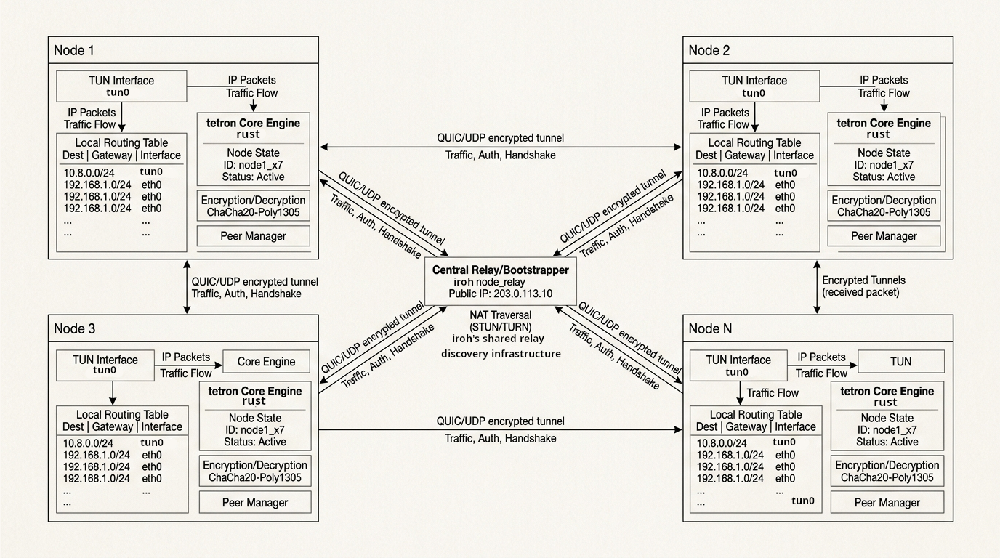

# tetron


Electric ray *Tetronarce californica*

**A standalone P2P mesh VPN.** tetron is a derivative of [rayfish](https://github.com/rayfish/rayfish), stripped to a single purpose: connect machines into a private overlay with stable identity-derived addresses. It defaults to `10.88.0.0/24` (an uncommon 10.x slice that avoids Tailscale's `100.64.0.0/10`).

**Prefer a browser or a menu bar to a terminal?** Everything below is the CLI, but you don't have to use it directly:

- **[tetron-webui](https://github.com/ErikAllanKincaid/tetron-webui)** -- a browser dashboard: status, create/join/leave, invites, and the full coordinator admin surface. This is likely the easiest way to run tetron day to day if you're not looking to live in a terminal.
- **[tetron-systray](https://github.com/ErikAllanKincaid/tetron-systray)** -- a menu-bar/tray client for glanceable status and quick per-network toggling.

Both are genuinely separate, opt-in clients talking to the same daemon underneath -- no daemon changes needed either way.

### TL;DR

```bash
sudo tetron install                               # start the node (installs the service)
tetron create --network-name home --hostname alice # you are the coordinator; output includes an invite key
# next: tetron join <invite-key>                  # <- copy this from the output, run it on the next machine

sudo tetron install                               # on a second machine:
tetron join <invite-key> --hostname bob           # paste the invite key from step 1's output

tetron status                                     # either machine: mesh IPs, hostnames, traffic
ping 10.88.x.y                                    # reach the other node by its mesh IP
```

`--network-name`/`--hostname` are optional (random name / machine hostname if omitted); `create`/`join` also take `--subnet <cidr>` and `--tor` — see [How to quickstart](#how-to-quickstart) below.

[](LICENSE)


> **This is not original software.** tetron is rayfish with a focused set of changes, kept as an honest fork under the same MPL-2.0 license. All credit for the mesh-VPN design belongs to [upstream rayfish](https://github.com/rayfish/rayfish).

**Want more?** This README covers getting started. For detailed walkthroughs, troubleshooting, and less-common scenarios (custom subnets, Tor transport, multi-machine deployment scripts), see **[docs/HOWTO.md](docs/HOWTO.md)**. For the ideas tetron is built on -- iroh, QUIC, WireGuard -- see **[docs/BACKGROUND.md](docs/BACKGROUND.md)**.

---

## How to quickstart

tetron runs a small root daemon (comparable to Tailscale's `tailscaled`) that owns the TUN device and the iroh endpoint. Everything else is an unprivileged `tetron` command talking to it over a local socket.

```bash
# 1. Install the binary and bring the node online (needs root once).
#    Linux (x86_64/aarch64) and macOS (aarch64/x86_64) binaries are both
#    published on releases -- swap tetron-linux-x86_64 below for
#    tetron-macos-aarch64/tetron-macos-x86_64 on a Mac:
curl -Lo tetron https://github.com/ErikAllanKincaid/tetron/releases/latest/download/tetron-linux-x86_64
chmod +x tetron
sudo install tetron /usr/local/bin/tetron
sudo tetron install

# 2. Create a network. Output includes your mesh IP and invite key.
#    --network-name/--hostname are optional; --subnet overrides the default
#    10.88.0.0/24 for *this* network only; --tor routes it over Tor.
tetron create --network-name mynet --hostname alice
tetron create --network-name mynet --hostname alice --subnet 10.77.0.0/16
tetron create --network-name mynet --hostname alice --tor

#    Sample output:
#      created mynet        ← network name
#        address  10.88.0.1  ·  abcd…1234
#      next: tetron join <invite-key>    single-use invite (one more available)
#            tetron invite <net> create  mint another invite
#            tetron resume               activate the VPN

# 3. On a second machine, join using the invite key from step 2 (--alias
#    sets a local-only display name; --tor mirrors the coordinator's transport
#    if it used one):
sudo tetron install
tetron join <invite-key> --hostname bob
tetron join <invite-key> --hostname bob --alias homelab --tor

# 4. From either machine:
tetron status                      # networks, peers, mesh IPs, hostnames, traffic
tetron status --json               # machine-readable, for scripting
ping <other-ip>                     # reach the other node by its mesh IP (from status)
```

Tailscale keeps working throughout -- tetron's default `10.88.0.0/24` does not overlap Tailscale's `100.64.0.0/10`. If that default collides with a network you already use, pass `--subnet` at create time (above) or set a new node-wide default with `tetron config set subnet <cidr>`; see [docs/HOWTO.md](docs/HOWTO.md) for details.

## Why this fork

Upstream rayfish hardcodes its overlay IPv4 range to `100.64.0.0/10` (the CGNAT range) and refuses to start if another interface already holds an address there -- exactly the range **Tailscale** uses, so stock rayfish and Tailscale cannot run on the same host. tetron makes the overlay subnet configurable and defaults it to a range that coexists with Tailscale, so both meshes run side by side. It also takes on a distinct identity (binary `tetron`, ALPNs `tetron/net/...`, config under `/etc/tetron`, UDP port 43737) so its traffic can never collide with rayfish on the same host, and strips several subsystems -- userspace firewall, Magic DNS, file sharing, device pairing, hostname rename, the declarative apply layer, self-update, and more -- because the purpose is a minimal, single-purpose mesh. Invite-key admission was re-added as the sole enrollment method.

## How it works

Each machine runs the `tetron` daemon. **Every network you join gets its own TUN device and its own subnet** -- structurally the same as plugging a second physical NIC into a second physical network, not one shared interface juggling multiple meshes. The daemon captures IP packets on each TUN and tunnels them over [iroh](https://iroh.computer) QUIC connections.

1. **Create.** One peer starts a network and becomes its coordinator. The network's public key is its **room id**: it lets others discover the network but is not enough to get in.
2. **Join.** A peer gets in using an **invite key** minted by a coordinator. The invite encodes the network pubkey and a one-time secret; the joiner presents the secret to any online coordinator, which validates it against the signed blob and admits the peer.
3. **Mesh.** In each network, every peer derives its own stable virtual IPv4 (in that network's own subnet) and IPv6 (its own `/56` block within `200::/7`, derived from identity *and* network) from its identity, then connects directly to every other peer in that network -- hole-punched where possible, falling back to encrypted relays otherwise.
4. **Use it.** Any TCP/UDP app works, addressed by the peer's mesh IP (from `tetron status`).

A node that belongs to two networks does **not** automatically route traffic between them (each stays a fully isolated peer mesh, like two separate physical networks would) -- if you need to bridge them, a node that's a member of both can jump-host at the application layer (`ssh -J`, port forwards) with zero extra configuration, since each hop is that node's own native connection to a peer it genuinely shares a network with.



Every node runs the identical daemon. Once two nodes can reach each other, traffic moves directly between them over an encrypted QUIC/UDP tunnel -- iroh's shared relay/discovery infrastructure only brokers the initial introduction and NAT traversal, and is never in the data path for an established connection. Each node's TUN device carries whatever name the OS assigns it (`tun0`, `tun1`, ...), not a fixed name.

For a longer, narrative take on the same architecture, see [**Tetron: Anatomy of a Mesh**](https://erikallankincaid.github.io/tetron/Tetron_AnatomyofaMesh.html) -- a field-guide-style writeup covering the daemon's internal structure, the path a packet takes, and how concurrent state is held. Third-party-style piece, included for a different angle on the same system rather than as an authoritative reference -- some details are simplified for narrative flow.

## Co-coordinators and admission

By default only the node that ran `tetron create` holds the network key -- a **single point of failure**: if it's offline, nobody else can admit joiners, mint invites, or kick members. Grant the key to every trusted member so the network stays operational no matter who's online:

```bash
tetron admin mynet add bob        # by hostname or short id (from `tetron status`)
```

Networks are **invite-only**: the only way in is an invite key, single-use by default (7-day expiry, `--expires` to change it). `tetron create` auto-mints the first one; any coordinator can mint more:

```bash
tetron invite mynet create                  # default: single-use, expires in 7 days
tetron invite mynet create --expires 24h    # shorter expiry
tetron invite mynet create --expires never  # never expires
tetron invite mynet list                    # see outstanding invites (--json for scripting)
tetron invite mynet revoke <invite-id>      # revoke before it's used
```

A bare room id is not enough to join. tetron has **no userspace firewall** -- within a shared network every peer reaches every port a local service binds. Restrict *which ports* with the host firewall (nftables/ufw) on the `tetron` TUN interface.

See [docs/HOWTO.md](docs/HOWTO.md) for kicking a member, listing key-holders, revoking invites, and more.

## Naming peers

Reach peers by their **mesh IP**, listed with their hostnames in `tetron status` (`--json` for scripting). A hostname is set once at join (`--hostname`) and is fixed after that -- there is no rename command; see [docs/HOWTO.md](docs/HOWTO.md) for the leave-and-rejoin workaround. `--hostname` names your node within the network; the network itself has its own name (random three words, or `--network-name` on `create`), used with `tetron leave <network-name>` etc. `tetron kick` requires an endpoint id (short id from `tetron status`), not a hostname or IP -- a deliberate restriction on a destructive command.

## Features

**Admission & networks:**

- **Invite-only closed networks** -- the only way onto a network is an invite key minted by a coordinator (`tetron invite <net> create`, single-use by default with configurable expiry). A bare room id is discovery-only and never admits.
- **Multi-segment TUN** -- every network you join gets its own TUN device and its own subnet, structurally isolated like two separate physical NICs. `tetron create --subnet <cidr>` sets a network's own subnet on the spot, no restart needed; `tetron config set subnet` changes the node-wide default for future creates.
- **Configurable overlay subnet** -- default `10.88.0.0/24` avoids Tailscale's `100.64.0.0/10`, so both run side by side on the same host.
- **Co-coordinators / multi-admin** -- `tetron admin <net> add <peer>` grants the network key to any trusted member, so admission, invite-minting, and member management don't depend on one machine staying online.
- **Nuke consensus** -- destroying a network with a single coordinator is immediate; with two or more coordinators, it requires a second coordinator to independently agree (`tetron nuke <net-id>` proposes/seconds, `--cancel` withdraws, `--second <id>` seconds explicitly) within a 24h window, so one compromised or reckless coordinator can't unilaterally destroy a network nobody else agreed to lose.
- **Kick** -- coordinators remove a member from a closed network by cryptographic short id (`tetron kick <net-id> <peer>`); the target is dropped mesh-wide and can't rejoin without a fresh invite.

**Addressing & transport:**

- **Dual-stack, per-network addressing** -- stable IPv4 in each network's own subnet, and stable IPv6 in its own routable `/56` block within `200::/7` (derived from identity *and* network, so the same node gets an unrelated address in each network it joins). Neither is ever transmitted or signed -- always freshly re-derived locally.
- **NAT traversal** -- direct QUIC connections with hole-punching (via [iroh](https://iroh.computer)), falling back to encrypted relays. A fixed UDP listen port (43737) is port-forwardable for guaranteed direct reachability.
- **Optional Tor transport** (`--tor` on `create`/`join`) -- mixing Tor and non-Tor peers on the same network is supported.
- **Custom relay/discovery servers** -- `tetron config set relay|discovery-dns` points at self-hosted infrastructure instead of the n0 defaults.

**Operations:**

- **Cross-platform service management** -- systemd on Linux, launchd on macOS; `tetron resume`/`install`/`restart`/`uninstall` handle it uniformly.
- **Tailscale-style permission model** -- the daemon authorizes by caller UID, not socket permissions; read-only commands are open to any local user, mutating commands need root or the configured operator (`set-operator`), auto-granted to whoever ran `tetron install`.
- **`--json` on every read command** -- `status`, `invite list`, `admin list`, `config get`, for scripting.
- **Near-instant standby** -- `tetron standby`/`resume` toggle just the data plane (TUN + routes) without dropping peer connections; `sudo tetron stop`/`start` go fully offline/online. Add `--network <name>` to either to standby just one joined network instead of all of them.

Run `tetron --help` (and `tetron <command> --help`) for the full surface: `create`/`join`/`leave`/`nuke`, `invite` (create/list/revoke), `admin` (add/list)/`kick`, `config` (get/set/unset), `status` (`--json`), `resume`/`standby`, `install`/`restart`/`uninstall`/`start`/`stop`, `set-operator`, `version`, and `completions`.

> **Removed from upstream rayfish**: file sharing and multi-device pairing, declarative apply layer (`apply`/`alias`), Magic DNS and all OS DNS mutation, userspace firewall, permissionless ("open") networks, hostname renaming, ephemeral members, and self-update. Packet filtering is the host firewall's job; name resolution is `/etc/hosts`'s job; copy files with `scp`/`rsync` over mesh IPs; upgrade by replacing the binary.

## Permissions

Like Tailscale, the daemon authorizes each command by the **caller's UID**, not file permissions. Read-only commands (`status`, `... show`) are open to any local user; mutating commands need root or the configured operator. The user who installs the service (`sudo tetron install`) becomes the operator automatically.

```bash
sudo tetron install | restart | uninstall   # manage the system service
sudo tetron start | stop                     # stop = fully offline; start = back online
sudo tetron set-operator <user>              # authorize a user to run tetron without sudo
```

`tetron resume` / `tetron standby` toggle only the data plane (near-instant standby); the daemon stays connected to peers across `standby`.

## Upgrading

There is no self-update; upgrade by replacing the binary:

```bash
git pull && cargo build --release
sudo install target/release/tetron /usr/local/bin/tetron
sudo tetron restart
tetron version                 # confirm the new build (version + git sha)
```

## Build & install

```bash
cargo build --release           # or `cargo -q build` for a debug build
cargo test                      # unit + integration tests
cargo clippy --all-targets      # lints (kept warning-free)
```

Cross-compiling / deploying to another Linux host (via the `justfile`):

```bash
just cross                      # build for x86_64 Linux
just deploy <ip>                # cross-build release + install + start on a remote host
just deploy-dev <ip>            # same, but a debug build (faster iteration)
```

tetron targets **Linux** (systemd service, x86_64/aarch64) and **macOS** (launchd daemon, aarch64/x86_64). Prebuilt binaries for both platforms are published on [Releases](https://github.com/ErikAllanKincaid/tetron/releases) (`tetron-linux-x86_64`/`tetron-linux-aarch64`/`tetron-macos-aarch64`/`tetron-macos-x86_64`) -- macOS support is live-verified on real Apple Silicon hardware, not just compiled. Android support is deferred.

## Uninstall

```bash
tetron leave <network-name>       # optional: leave gracefully first, so the coordinator can prune you
sudo tetron uninstall             # removes the system service (systemd on Linux, launchd on macOS)
sudo rm -rf /etc/tetron/          # optional: wipe config + identity on Linux (~/.config/tetron on
                                   # macOS) -- back up /etc/tetron/secret_key first if you need the key
```

Don't run `tetron nuke <net-id>` when uninstalling -- that destroys the network for everyone, not just your machine (`tetron leave` is the per-machine equivalent).

## Development

Developed with [Specification-driven development](https://en.wikipedia.org/wiki/Specification-driven_development) using [libspec](https://github.com/drhodes/libspec). Each requirement is a documented class in `spec/design_spec.py`; the `reconcile.py` gate enforces automatable constraints. Commits are recorded with `libspec link` so the spec keeps a complete history alongside the code.

## Relationship to upstream & license

tetron is a derivative of [rayfish](https://github.com/rayfish/rayfish), licensed under the **Mozilla Public License 2.0** (`LICENSE`), the same as upstream. The entire mesh-VPN design, and the overwhelming majority of the code, is rayfish's work; see the [changelog](CHANGELOG.md) for what this fork changes. If you want the general, upstream-quality version of configurable subnets, that belongs in rayfish itself -- this fork is a scrappier, personal-use variant.
